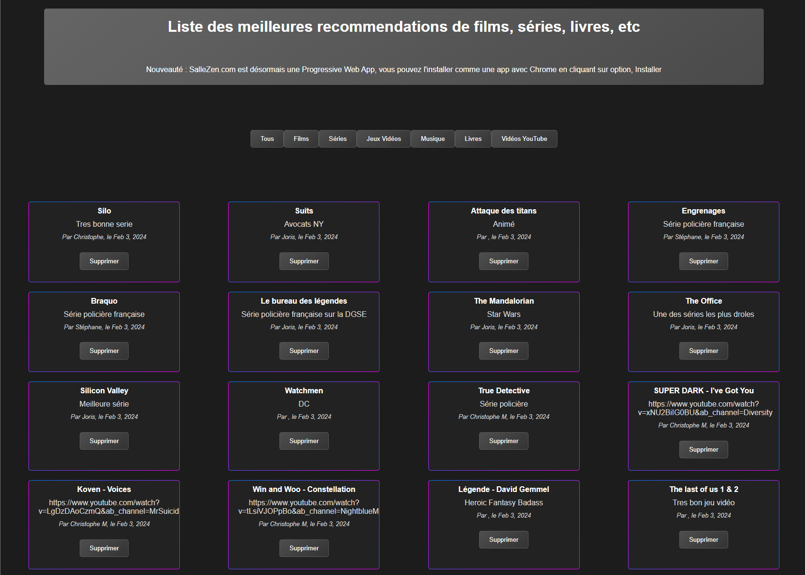

# Salle Zen

## The project

Salle Zen - Angular is the frontend for

- SalleZen-CSharp https://github.com/ironjerseys/SalleZen-CSharp
You can see it here on Azure : https://sallezen.com/

It is build with Angular 17 and TypeScript 5.4.3

You can save the list of the bests movies, tv-shows, books, musics, etc
Everything is public, so you can discover new things or share yours

## How to install it :

```
Git clone https://github.com/ironjerseys/SalleZen-Angular.git
```
```
cd Salle-Zen-Angular
```
```
npm install
```
```
npm run start
```


